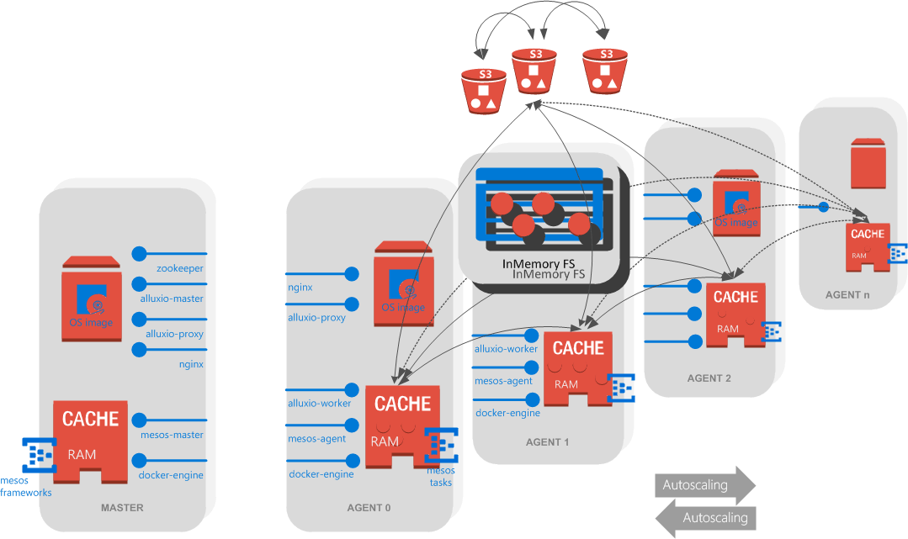
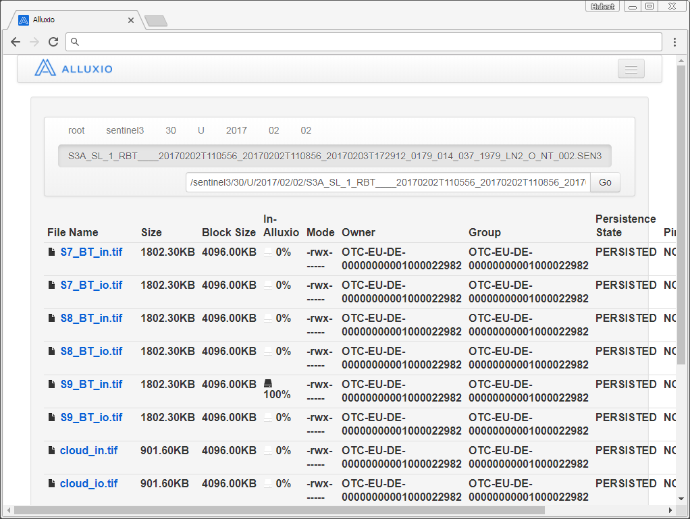
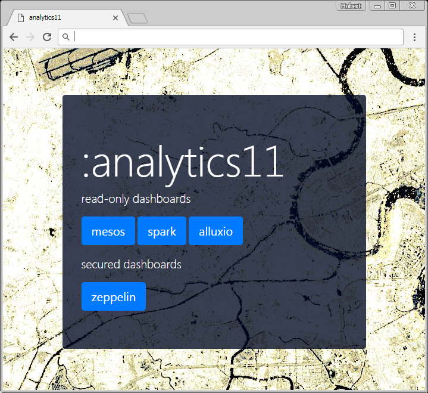
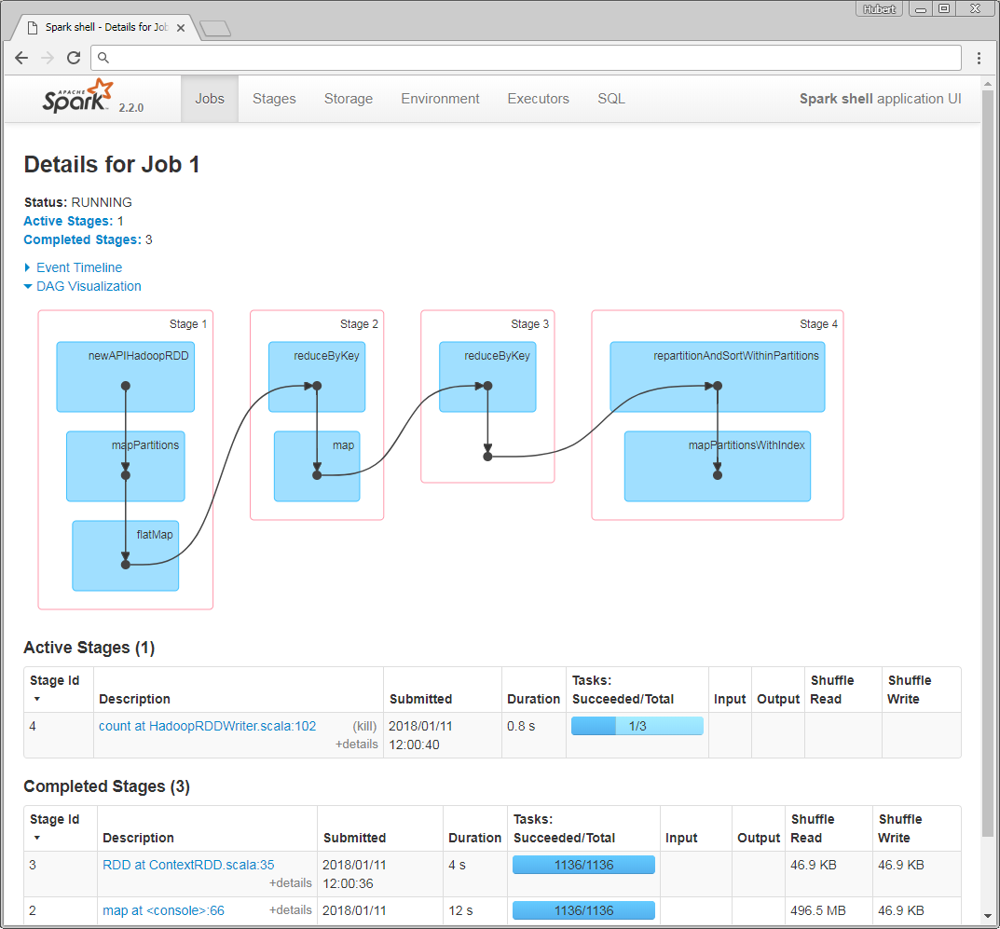
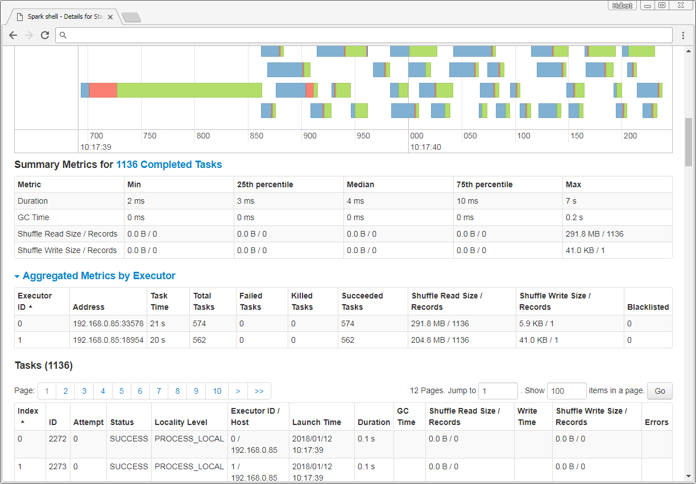
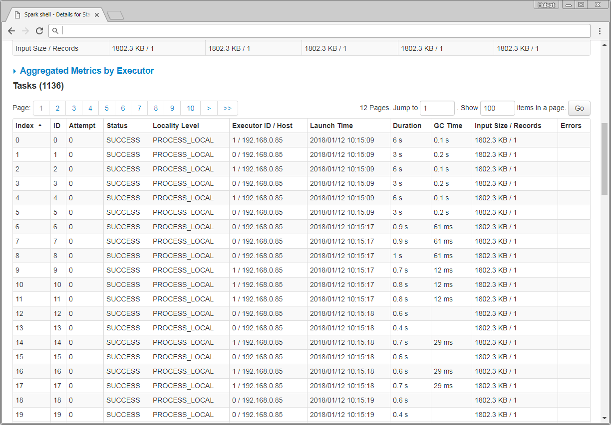
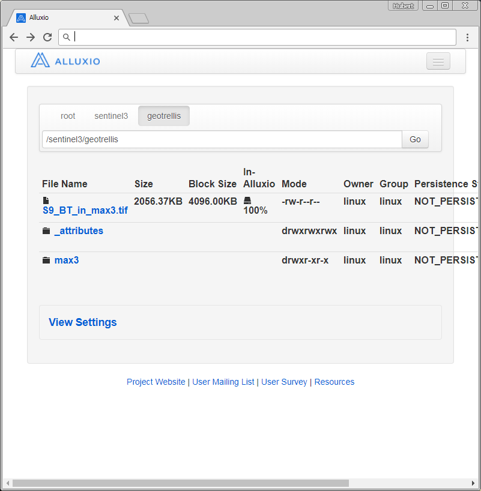

ansible-mesos
=============
Playbooks and roles for mesos & alluxio deployment on Open Telekom Cloud (OTC)

##  what you get
- mesos cluster with one master (multi-master HA setup coming soon) and private agents within an autoscaling group (private IPs)
- distributed alluxio inMemory-FS accross mesos-agents (useable via alluxio-proxy REST API at `localhost:39999` on every cluster-node)
- alluxio underFS configured for S3 (OBS)
- readonly ssl enabled webUI & dashboards of `mesos` and `alluxio`
- cached nginx proxy for otc-instance metadata endpoints accessible at every node at  `localhost/user-data`
- jenkins instance for static processing pipelines (deactivated by default)



## why you want this
- for running batch-processing workloads on mesos from and to S3 optionally using an InMemory cache for intermediate data or results
- doing batch or distributed processing using `fast` InMemory-data with mesos-frameworks like `spark`, `storm` or `mesos-batch`
- to run analytics on selected and optionally cached datasets from S3

## what you need
- ansible control host with internet access (preferably linuxOS)
- python, pip, ansible, awscli (for interaction with S3 and boto-dependency) installed
  ```sh
  # e.g. for centos...
  yum -y update
  yum -y install epel-release
  yum -y update
  yum -y install python-pip jq
  pip install --upgrade pip
  pip install awscli certifi
  ```
- OTC privileged account (admin-role)
- proper `clouds.yml` config in ~/.config/openstack/clouds.yml
  * Example of clouds.yml:
    ```yaml
    clouds:
      otc:
        auth:
          auth_url: https://iam.eu-de.otc.t-systems.com:443/v3
          username: -your-otc-privileged-username-
          password: -your-otc-privileged-username-password-
          project_name: eu-de
          project_domain_name: -your-domain-id- (e.g.8834sdfec3cc84120aac157xyz1234)
          user_domain_name: -your-domain-name- (e.g. OTC-EU-DE-0000000000xxxxxx)
        region_name: eu-de
    ```
- OTC Access keys with read/write permissions for S3
user-access keys consist of `access_key_id` and  `secret_access_key` and must be generated within the OTC web-console. It's recommanded to generate a seperate user with read/write permissions to OBS (S3) 
- OTC-static conf needed:
    - existing ssh-key, linked to existing OTC key-pair
    - OTC Machine-Image (Image-ID)
       - centos7.2-docker1.17-mesos1.4.0-jenkins2.79-alluxio1.6-https
       - centos7.2 with docker engine 1.17, mesos 1.4.0, alluxio 1.6 jenkins 2.7, awscli, nginx (public readonly sites via ssl), no firewalld, no selinux, some network tweaks, iptables service, ip forwarding, all mentioned core services are disabled by default
       - shared with you within OTC `on request`

# Sentinel-3 spark-mesos demo
The following steps could be seen as an end-to-end tutorial from preparing a control host to bootstrap a cluster within the cloud and to the actual interesting part: `writing eo spark-workflows in scala.`

## pre step 1: where is the input eo data?
This step is completely decoupled from the whole cluster/spark/mesos/kubernetes... stuff. Copy your eo-data to the Cloud-provider's object-storage. This is in all cases some form/derivate of `S3`
- the copy process itself should be done using e.g. aws-cli, which also works really well for OTC-S3
- when trying to upload huge amounts (+100TB) of data, consider alternative approaches, like exposing your data to some https-get endpoint, use datahubs like `code-de` or `esa sentinel sci hubs`  and pull this data from within the cloud (e.g. from an ingestion batch-system like in [asamerh4/sentinel3-s3-ingestion-pipeline](https://github.com/asamerh4/sentinel3-s3-ingestion-pipeline)). Some cloud providers offer import/export appliances (e.g. AWS-snowball), but that's another story
- try to structure your data within a S3-bucket with meaningful and human readable `spatiotemporal indexes`.
  -  if your data is already geo-referenced in some form, try to press it through a standardized tiling system, like MGRS or any other rectangular `{x/y/z}` system.
  - an index (=folder structure within S3-bucket) could start with spatial info, continued by a temporal part and finished with product specific infos...
  - these object storage indexes do have significant impact on I/O throughput. Construct such a structure based on your future analytics use cases. Higher index level diversity guarantees better balancing on the S3-backend service. ~
  - like so: /sentinel3/30/U/2017/08/07/S3A_SL_1_RBT____20170807T220927_20170807T221227_20170808T004159_0179_021_001_0719_SVL_O_NR_002.SEN3/S9_BT_io.tif
  - like in: [asamerh4/sentinel3-to-utm-pipeline](https://github.com/asamerh4/sentinel3-to-utm-pipeline)

### Demo S3-bucket seen with alluxio
Alluxio is used as distributed FS between worker-nodes. It has hadoop-comapitible API's and follows the same principles as hdfs - but all in RAM.



## pre step 2: provision your own cluster
As a prerequisite to run some spark eo workloads you should have some form of mesos/alluxio cluster running. Mesos acts as the execution base-platform - think of general purpose resource scheduling.

### prepare your control host
Your control host (a linux host where ansible is installed to communicate with the cloud-APIs to create something like a mesos/spark cluster), which could be your office-client computer, or a VirtualboxVM, or some plain normal on-premise linux server must have access to the cloud-providers API-endpoints. In our case we need access (https) to the OTC-API servers. Mandatory packages to be installed on control host are:
- git, epel, python(2.7++), python-pip, ansible, awscli

### generate OTC key-pair & copy to control-host
To create VM's within OTC and ssh to them, you have to create a key-pair within the OTC webPortal.
- create key-pair in OTC-webUI
- download key and copy to control host
- change key's UNIX permissions to 0600

### clone this repo to the control host
```bash
git clone https://github.com/asamerh4/ansible-mesos.git
cd ansible-mesos
```

### edit or create `vars/main.yml`
Do not edit lines containing `{{ variable }}` 
```python
---
alluxio_block_size: "{{ alluxio_block_size }}"
alluxio_underfs_s3: "{{ alluxio_underfs_s3 }}"
# size of alluxio ramdisk on every worker
alluxio_ramfs_size_gb_std: 12
alluxio_ramfs_size_gb_big: 100
availability_zone: "eu-de-02"
# OTC-access keys used for OTC-S3 (same nomenclature as in aws ;-))
aws_access_key_id: "ZJNJJYYYYYYXXXYYYKC1FNH"
aws_secret_access_key: "D2Em8ZZZZZZZZZZZZXXXXZZZZZZZt2bfMcZ"
cluster_id: "{{ cluster_id }}"
# size of VM root volume (OTC)
ecs_disk_size: "10"
# VM's root volume disk type (OTC)
ecs_disk_type: "SSD"
# VM type (2 cores 16GB RAM)
ecs_flavour: "highmem2"
# VM-OTC-Image (derived `scripts/otc_create_machine_image.py`)
image_id: "eb35e995-ff00-4661-a7bd-04032ae1a569"
# base image, when building image using `scripts/otc_create_machine_image.py`
base_image_id: "d1a4e2fc-6b30-4d2b-97e9-e343a2d3d2b7"
mesos_cluster_name: "{{ cluster_id }}"
otc_ssh_key_name: "{{ otc_ssh_key_name }}"
# size of ramdisk mainly for container working dirs `/var/lib/docker`
ramdisk_gb: "10"
# OTC VPC config
subnet_cidr: "192.168.0.0/24"
subnet_dns1: "100.125.4.25"
subnet_dns2: "8.8.8.8"
subnet_gate: "192.168.0.1"
vpc_cidr: "192.168.0.0/16"
vpc_nexthop_ip: "192.168.0.2"
vpc_toplevel_name: "{{ cluster_id }}"
```

### optionally build machineImage
The script in `scripts/otc_create_machine_image.py` is used to automate the creation of an OTC machineImage, which is used to form a spark/alluxio/mesos cluster. Start the script from the repo's root dir:
```bash
python scripts/otc_create_machine_image.py -k "~/mesos130-api.pem" -ok mesos130-api -u linux eu-de
```
Once finished, the resulting VM-image is available within your OTC-account (=tenant) and contains the following main components:
- systemd services (all disabled by default):
   - zookeeper
   - mesos-master
   - mesos-agent
   - docker-engine
   - alluxio-master
   - alluxio-worker
   - alluxio-proxy
   - nginx
   - spark-shuffle-service
- prepared frameworks:
   - spark (/opt/spark)
   - alluxio (/opt/alluxio)
   - zeppelin

These components act as the single base of all subsequent generated VM-instances. All service configuration we defined in `vars/main.yml` is injected when the cluster playbook is executed. (see next step)

`Note:` when customizing the machineImage (`tasks/machineImage.yml`), keep in mind that you should only add/install packages which are used by all VM-types in our cluster. (e.g. masters, agents, edge-nodes). Also the resulting image size is quite important. Larger images (+2GB) tend to have significant longer deployment-times than lean ones. (~1GB)

### create cluster
Now we have everything ready for creating a cluster with 1 master and 1 agent (=initial autoscaling group size)
```bash
cd ansible-mesos
python scripts/otc_deploy.py -z -m \
# OTC-S3 bucket which is used as alluxio underFS
  -s3 "s3a://alluxio-tests/tests" \
# alluxio inmemoryFS block size in MB
  -b 4 \
# our ssh-key
  -k "~/mesos130-api.pem" \
# our ssh-key name within otc
  -ok mesos130-api \
# user inside VM
  -u linux \
# otc region
 eu-de \
# cluster name
 analytics11 \
# provision means provision
 provision
```
example ansible output (omitted):
```
PLAY [localhost] ***************************************************************

TASK [Gathering Facts] *********************************************************
ok: [localhost]
...
...
TASK [asconfig_create : Create ASConfig] ***************************************
skipping: [localhost]

TASK [asgroup_create : Create ASGroup] *****************************************
skipping: [localhost]

TASK [asgroup_create : Enable AS-Group] ****************************************
skipping: [localhost]

TASK [vpc_disable_checks : Request VPC-ports from API] *************************
ok: [localhost]

TASK [vpc_disable_checks : Disable source/destination check of master] *********
ok: [localhost]

PLAY RECAP *********************************************************************
80.158.16.5                : ok=49   changed=9    unreachable=0    failed=0
localhost                  : ok=83   changed=4    unreachable=0    failed=0
```

### point your browser to the cluster-dashboard
Ansible shows the public-IP of our mesos-master, which acts also as a lean nginx-server via https. Read-only dashboards of alluxio, mesos, spark & zeppelin are reverse-proxied and available via the internet. This is especially useful when working with spark.

`Caution`: no auth-solution is deployed so far. For more production-like deployments consider to lock down this nginx-server, with e.g. oauth

The nginx-ssl config uses a self-signed certificate. Modern browsers raise some security warnings about this. If you plan to maintain a permanent solution, then get your trusted cert, get a free domain, and so on... 

The landing page looks like this:


```
https://PUBLIC-IP/
           |----> state.json # mesos-state info
           |----> spark      # spark-UI, when active spark-context on internal port 4040
           |----> alluxio    # alluxio-UI
           |----> zeppelin   # zeppelin
```

### some security notes
The only public accessible interfaces to our cluster are:
- ssh to mesos-master with ssh-key (via port 22)
- https to mesos-master (via port 443)

All agent nodes in the autoscaling group do not have public IP's
- only the internal mesos-master IP has access to the private agents
- ssh to agents is only possible from mesos-master by using our ssh-key

network and security groups topology:
```
VPC (192.168.0.0/16)
|- subnet (192.168.0.0/24)
   |- public-group
   |  |-Inbound (TCP): port 22, 443 for remote end 0.0.0.0/0 (world)
   |  |-Outbound (Any): any port for remote end 0.0.0.0/0 (world)
   |
   |- master-group
   |  |-Inbound (TCP): port 5050, 19999, 39999 for remote end 192.168.0.0/24 (subnet)
   |  |-Outbound (Any): any port for remote end 0.0.0.0/0 (world)
   |
   |- zookeeper-group
   |  |-Inbound (TCP): port 3888, 2181, 2888 for remote end 192.168.0.0/24 (subnet)
   |  |-Outbound (Any): any port for remote end 0.0.0.0/0 (world)
   |
   |- agent-group
      |-Inbound (TCP): port 22, 1024-60000 for remote end 192.168.0.0/24 (subnet)
      |-Outbound (Any): any port for remote end 0.0.0.0/0 (world)
```
mapping of sec-topology to VM-deployment:
```
mesos-masters
|-public-group
|-master-group
|-zookeeper-group

mesos-agents (autoscaling group)
|-agent-group
```

## step 1: enter SPARK
Now we're ready to ssh into our mesos-master and start a spark-shell. This demo invokes the spark-shell which registers as a mesos-framework using the `--master` commandline parameter. All required scala/java classes for working with the data (from S3 and alluxio) are assembled to a so called `fat-jar` and referenced using the `--jars` parameter. When spark starts in client mode (default) these jars are automatically synced to all agents (mesos worker nodes).

### clone spark/gdal/geotrellis repo & build a fat-jar

The repo in [asamerh4/spark-eo-testbed](https://github.com/asamerh4/spark-eo-testbed) contains a scala project and is used to assemble all dependencies like geotrellis et al. to a single jar file. When `build.sh` is executed, a docker image for assembling the jar file is built. The jar file is then copied out from the container to the current path.

```sh
ssh -i "{{ ssh-key }}" linux@{{ mesos-master-PublicIP }}
git clone https://github.com/asamerh4/spark-eo-testbed.git
cd spark-eo-testbed
./build.sh
```

## start spark-shell

```sh
# get private IP (mesos-master is bound to our private IP)
MESOS_MASTER=$(hostname -I | awk -F " " '{print $1}')
/opt/spark/bin/spark-shell \
  --master mesos://$MESOS_MASTER:5050 \
  --jars /home/linux/spark-eo-testbed/testbed-assembly-1.0.jar \
  --conf spark.executor.cores=1
...
...
I0111 12:23:48.656080 87108 sched.cpp:759] Framework registered with 56dd8314-a408-4ee3-8c89-8e116fd699fd-0002
18/01/11 12:23:49 WARN MesosCoarseGrainedSchedulerBackend: Unable to parse  into a key:value label for the task.
18/01/11 12:23:49 WARN MesosCoarseGrainedSchedulerBackend: Unable to parse  into a key:value label for the task.
18/01/11 12:23:54 WARN ObjectStore: Failed to get database global_temp, returning NoSuchObjectException
Spark context Web UI available at http://192.168.0.36:4040
Spark context available as 'sc' (master = mesos://192.168.0.36:5050, app id = 56                             dd8314-a408-4ee3-8c89-8e116fd699fd-0002).
Spark session available as 'spark'.
Welcome to
      ____              __
     / __/__  ___ _____/ /__
    _\ \/ _ \/ _ `/ __/  '_/
   /___/ .__/\_,_/_/ /_/\_\   version 2.2.0
      /_/

Using Scala version 2.11.8 (OpenJDK 64-Bit Server VM, Java 1.8.0_151)
Type in expressions to have them evaluated.
Type :help for more information.

scala>
```
## REPL inserts

Enter the following lines to the interactive spark-shell, which is a so called `Read–Eval–Print Loop` (line by line or paste the whole block). Each line is evaluated and executed like you propably know from interactive notebooks like jupyter or zeppelin.
```scala
import alluxio.master.MasterClientConfig;
import geotrellis.raster._
import geotrellis.raster.io.geotiff._
import geotrellis.raster.resample._
import geotrellis.spark._
import geotrellis.spark.io._
import geotrellis.spark.io.hadoop._
import geotrellis.spark.tiling._
import geotrellis.util._
import geotrellis.vector.{Extent, ProjectedExtent}
import geotrellis.spark.io.index.ZCurveKeyIndexMethod
import org.apache.hadoop.fs.Path
import org.apache.spark.HashPartitioner
import org.apache.spark.rdd.RDD

val alluxio_master = MasterClientConfig.defaults.getMasterInquireClient.getMasterRpcAddresses.get(0).toString

//masks
val tiffs = sc.hadoopGeoTiffRDD("alluxio:/"+alluxio_master+"/sentinel3/30/U/*/*/*/*/S9_BT_in.tif")
val maskRDD: RDD[(ProjectedExtent, Tile)] = tiffs
val (_, rasterMetaData) = TileLayerMetadata.fromRdd(maskRDD, FloatingLayoutScheme(512))

val tilerOptions = Tiler.Options(resampleMethod = Bilinear, partitioner = new HashPartitioner(maskRDD.partitions.length))

val tiled: RDD[(SpatialKey, Tile)] = maskRDD.tileToLayout(rasterMetaData, tilerOptions)
// val layerRdd: TileLayerRDD[SpatialKey] = ContextRDD(tiled, rasterMetaData)

//TEMPERATURE
val maximumTemperature = tiled.map { case (key, tile) => (key.getComponent[SpatialKey], tile)}.reduceByKey(_.localMax(_))

implicit val sparkContext = sc
val maxRdd: TileLayerRDD[SpatialKey] = ContextRDD(maximumTemperature, rasterMetaData)

val catalogPathHdfs = new Path("alluxio:/"+alluxio_master+"/sentinel3/geotrellis/")
implicit val attributeStore = HadoopAttributeStore(catalogPathHdfs)
val writer = HadoopLayerWriter(catalogPathHdfs, attributeStore)
val layerId = LayerId("max3", 0)
writer.write(layerId, maxRdd, index.ZCurveKeyIndexMethod)
// also write out a GeoTiff
val layoutextent: Extent = rasterMetaData.layoutExtent
val crs = rasterMetaData.crs
GeoTiff(maxRdd.stitch, layoutextent, crs).write(new Path("alluxio:/"+alluxio_master+"/sentinel3/geotrellis/S9_BT_in_max3.tif"))
```
`Further infos:`Use the spark shell for development and live result evaluation. Once your code is mature you should consider to package the functions and objects to the fat-jar repo and use `spark-submit` instead of spark-shell to run your code on the cluster. like in: [demo-testbed](https://github.com/asamerh4/spark-eo-testbed/blob/master/testbed/src/main/scala/Main.scala)

spark-submit example (from mesos-master bash):
```sh
/opt/spark/bin/spark-submit \
  --master mesos://$MESOS_MASTER:5050 --class testbed.SparkApp spark-eo-testbed/testbed-assembly-1.0.jar
```

## open spark-ui dashboard




## result :-)
Point your browser to https://PUBLIC-IP/alluxio and navigate to our distributed inMemoryFS, which is transparent to an underlying S3-bucket. This S3-bucket was configured in pre-step2!

`Note:` Our scala code stored some data to Alluxio. This data is available inside the alluxioFS and could then be persisted (read [alluxio-docs](https://www.alluxio.org/docs/master/en/Clients-Alluxio-Java.html)) to our underlying S3-bucket. If for instance our cluster is terminated, the inMemoryFS is gone and all unpersisted data is also gone!



